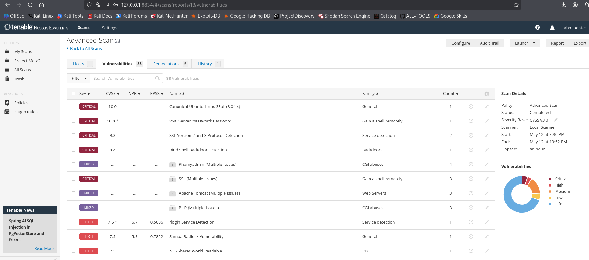
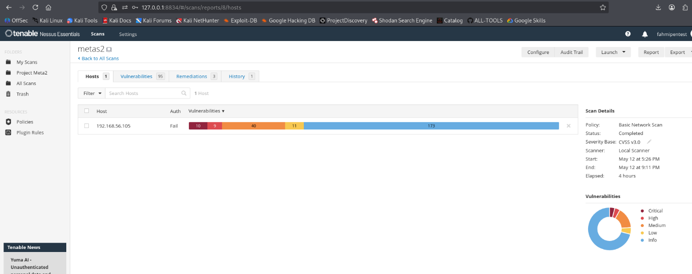
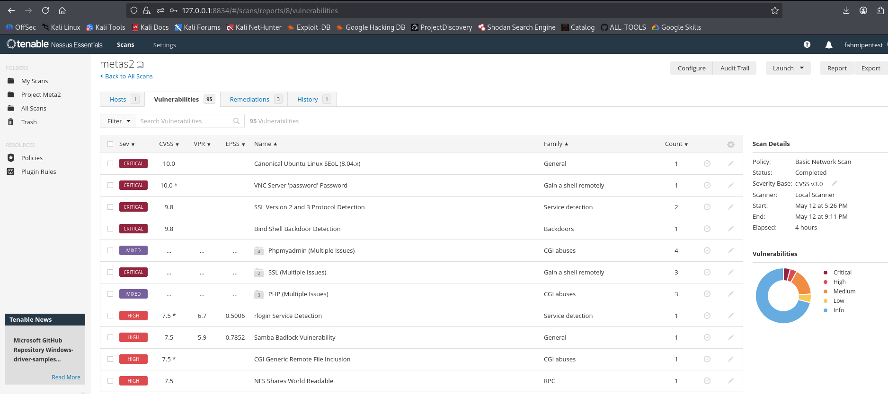
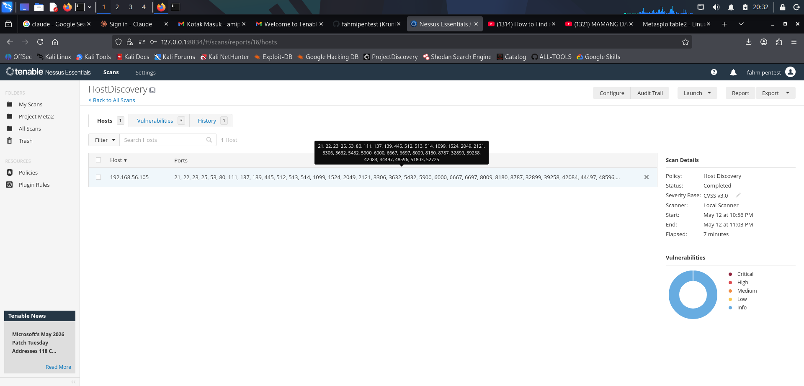
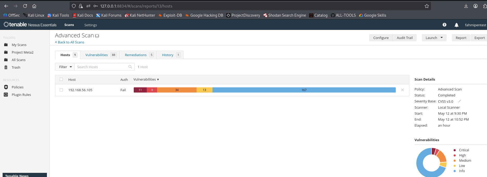
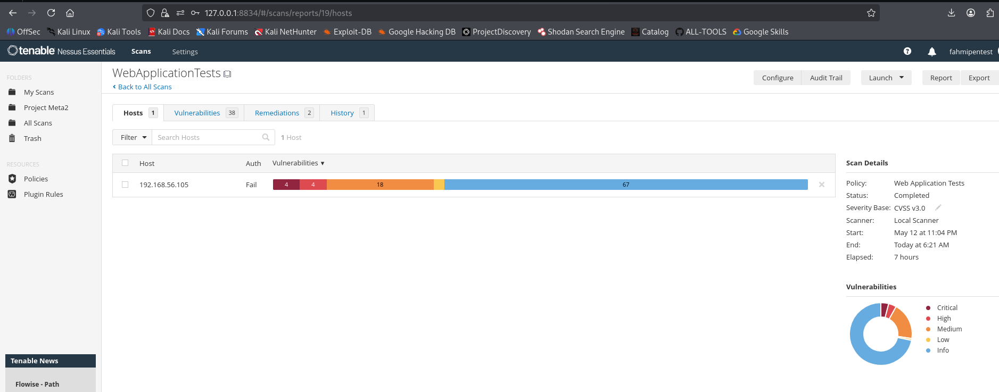
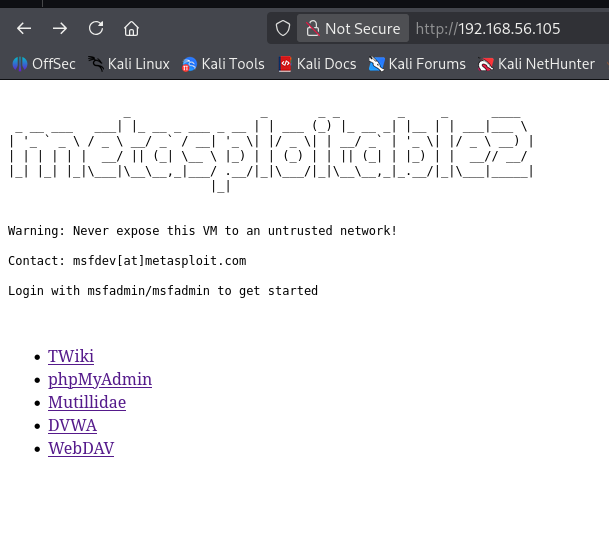
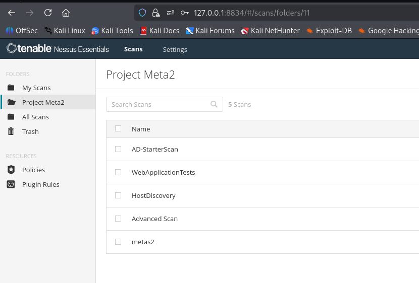

[README.md](https://github.com/user-attachments/files/27756218/README.md)
# 🔍 Vulnerability Assessment Report — Nessus Essentials

<div align="center">


**Laporan hasil Vulnerability Assessment menggunakan Nessus Essentials (Free)**  
terhadap **Metasploitable 2** di lingkungan lab terkontrol

</div>

---

## ⚠️ Disclaimer

> **Seluruh pengujian dalam laporan ini dilakukan di lingkungan lab terkontrol (Home Lab) menggunakan Virtual Machine yang sengaja dibuat rentan (Metasploitable 2). Tidak ada sistem production atau milik pihak ketiga yang diuji. Laporan ini dibuat semata-mata untuk keperluan edukasi dan latihan penetration testing.**

---

## 📋 Table of Contents

- [Lab Environment](#%EF%B8%8F-lab-environment)
- [Nessus Project Overview](#-nessus-project-overview)
- [Executive Summary](#-executive-summary)
- [Scan 1 — Host Discovery](#-scan-1--host-discovery)
- [Scan 2 — Basic Network Scan](#-scan-2--basic-network-scan)
- [Scan 3 — Advanced Scan](#-scan-3--advanced-scan)
- [Scan 4 — Web Application Tests](#-scan-4--web-application-tests)
- [Scan Comparison](#-scan-comparison)
- [Remediation Recommendations](#%EF%B8%8F-remediation-recommendations)
- [Key Takeaways](#-key-takeaways)
- [Tools Used](#-tools-used)

---

## 🖥️ Lab Environment

| Parameter | Detail |
|-----------|--------|
| **Scanner** | Nessus Essentials (Free) |
| **Scanner Host** | Kali Linux — `127.0.0.1:8834` |
| **Target VM** | Metasploitable 2 |
| **Target OS** | Ubuntu Linux 8.04 LTS (intentionally vulnerable) |
| **Target IP** | `192.168.56.105` |
| **Network Type** | Host-Only Network (VirtualBox) |
| **Severity Base** | CVSS v3.0 |
| **Nessus Project** | Project Meta2 |
| **Scan Date** | 12–13 Mei 2025 |

### Target: Metasploitable 2



Metasploitable 2 menyediakan berbagai layanan yang sengaja rentan, antara lain TWiki, phpMyAdmin, Mutillidae, DVWA (Damn Vulnerable Web Application), dan WebDAV.

---

## 📂 Nessus Project Overview



Project **"Project Meta2"** berisi **5 scan** yang dikonfigurasi:

| Scan Name | Policy | Status |
|-----------|--------|--------|
| AD-StarterScan | Active Directory Starter Scan | ✅ Completed |
| WebApplicationTests | Web Application Tests | ✅ Completed |
| HostDiscovery | Host Discovery | ✅ Completed |
| Advanced Scan | Advanced Scan | ✅ Completed |
| metas2 | Basic Network Scan | ✅ Completed |

> **Catatan:** Nessus Essentials (Free) tidak menyediakan fitur export laporan ke PDF/XML/CSV. Laporan ini disusun manual dari screenshot hasil scan.

---

## 📊 Executive Summary

Keseluruhan 4 tipe scan dilakukan terhadap target `192.168.56.105`:

| Scan | Duration | 🔴 Critical | 🟠 High | 🟡 Medium | 🔵 Low | ℹ️ Info | Remediations |
|------|----------|------------|---------|----------|-------|---------|-------------|
| Host Discovery | 7 menit | — | — | — | — | 3 | N/A |
| Basic Network Scan | 4 jam | **10** | **9** | **40** | **11** | 173 | 3 |
| Advanced Scan | ~1 jam | **11** | **9** | **34** | **13** | 167 | 5 |
| Web Application Tests | 7 jam | **4** | **4** | **18** | — | 67 | 2 |

### Severity Scale (CVSS v3.0)

| Severity | Score Range | Description |
|----------|-------------|-------------|
| 🔴 **CRITICAL** | 9.0 – 10.0 | Dapat dieksploitasi penuh tanpa autentikasi |
| 🟠 **HIGH** | 7.0 – 8.9 | Dapat menyebabkan kompromi sistem |
| 🟡 **MEDIUM** | 4.0 – 6.9 | Memerlukan kondisi tertentu untuk dieksploitasi |
| 🔵 **LOW** | 0.1 – 3.9 | Dampak minimal |
| ℹ️ **INFO** | N/A | Informasi tambahan, bukan kerentanan langsung |

---

## 🔎 Scan 1 — Host Discovery

### Scan Details

| Parameter | Value |
|-----------|-------|
| Policy | Host Discovery |
| Status | ✅ Completed |
| Start | May 12 at 10:56 PM |
| End | May 12 at 11:03 PM |
| Elapsed | **7 minutes** |
| Scanner | Local Scanner |

### Screenshots





### Open Ports Discovered

Host Discovery berhasil menemukan **1 host aktif** dengan **34+ port terbuka**:

```
21 (FTP)          22 (SSH)          23 (Telnet)       25 (SMTP)
53 (DNS)          80 (HTTP)        111 (RPC)         137 (NetBIOS-NS)
139 (NetBIOS-SSN) 445 (SMB)        512 (rexec)       513 (rlogin)
514 (rsh)        1099 (RMI)       1524 (Backdoor)   2049 (NFS)
2121 (FTP-alt)   3306 (MySQL)     3632 (distcc)     5432 (PostgreSQL)
5900 (VNC)       6000 (X11)       6667 (IRC)        6697 (IRC-SSL)
8009 (AJP)       8180 (Tomcat)    8787 (MSF-RPC)   + dynamic ports
```

> ⚠️ **Notable ports:** `1524` (bind shell backdoor), `5900` (VNC), `8787` (Metasploit RPC), `23` (Telnet plaintext), `514` (rsh tanpa autentikasi).

---

## 🔎 Scan 2 — Basic Network Scan

### Scan Details

| Parameter | Value |
|-----------|-------|
| Policy | Basic Network Scan |
| Status | ✅ Completed |
| Start | May 12 at 5:26 PM |
| End | May 12 at 9:11 PM |
| Elapsed | **4 hours** |
| Authentication | ❌ Fail (Unauthenticated) |
| Total Findings | **95 unique vulnerabilities** |

### Vulnerability Count

| 🔴 Critical | 🟠 High | 🟡 Medium | 🔵 Low | ℹ️ Info |
|------------|---------|----------|-------|---------|
| **10** | **9** | **40** | **11** | 173 |

### Screenshots





### Vulnerability List

| Severity | CVSS | Vulnerability | Family | Count |
|----------|------|---------------|--------|-------|
| 🔴 CRITICAL | 10.0 | Canonical Ubuntu Linux SEoL (8.04.x) | General | 1 |
| 🔴 CRITICAL | 10.0 | VNC Server 'password' Password | Gain a shell remotely | 1 |
| 🔴 CRITICAL | 9.8 | SSL Version 2 and 3 Protocol Detection | Service detection | 2 |
| 🔴 CRITICAL | 9.8 | Bind Shell Backdoor Detection | Backdoors | 1 |
| 🔴 CRITICAL | Mixed | SSL (Multiple Issues) | Gain a shell remotely | 3 |
| 🟠 HIGH | 7.5 | rlogin Service Detection | Service detection | 1 |
| 🟠 HIGH | 7.5 | Samba Badlock Vulnerability | General | 1 |
| 🟠 HIGH | 7.5 | CGI Generic Remote File Inclusion | CGI abuses | 1 |
| 🟠 HIGH | 7.5 | NFS Shares World Readable | RPC | 1 |
| ⚠️ MIXED | ... | Phpmyadmin (Multiple Issues) | CGI abuses | 4 |
| ⚠️ MIXED | ... | PHP (Multiple Issues) | CGI abuses | 3 |

### Critical Findings Analysis

<details>
<summary><strong>🔴 Ubuntu Linux 8.04 EOL — CVSS 10.0</strong></summary>

Ubuntu 8.04 sudah **End-of-Life sejak April 2013** dan tidak mendapat security patch. Ratusan CVE yang sudah dipublikasi dapat dieksploitasi tanpa ada patch dari vendor.

**Impact:** Full system compromise melalui unpatched kernel exploits dan service vulnerabilities.
</details>

<details>
<summary><strong>🔴 VNC Server Password "password" — CVSS 10.0</strong></summary>

VNC dikonfigurasi dengan password default `password`. Penyerang dapat langsung melakukan **remote desktop takeover** tanpa usaha brute-force.

**Impact:** Full graphical access ke desktop target.
</details>

<details>
<summary><strong>🔴 SSL v2/v3 Protocol Detection — CVSS 9.8</strong></summary>

SSL v2 dan v3 rentan terhadap **POODLE** dan **DROWN** attack. Memungkinkan man-in-the-middle dan dekripsi traffic.

**Impact:** Credential stealing, traffic decryption.
</details>

<details>
<summary><strong>🔴 Bind Shell Backdoor — CVSS 9.8</strong></summary>

Port **1524** memiliki bind shell yang memberikan **akses root langsung tanpa autentikasi**.

**Impact:** Immediate root shell access.
</details>

---

## 🔎 Scan 3 — Advanced Scan

### Scan Details

| Parameter | Value |
|-----------|-------|
| Policy | Advanced Scan |
| Status | ✅ Completed |
| Start | May 12 at 9:30 PM |
| End | May 12 at 10:52 PM |
| Elapsed | **~1 hour** |
| Authentication | ❌ Fail (Unauthenticated) |
| Total Findings | **88 unique vulnerabilities** |

### Vulnerability Count

| 🔴 Critical | 🟠 High | 🟡 Medium | 🔵 Low | ℹ️ Info |
|------------|---------|----------|-------|---------|
| **11** | **9** | **34** | **13** | 167 |

### Screenshots




### Vulnerability List

| Severity | CVSS | Vulnerability | Family | Count |
|----------|------|---------------|--------|-------|
| 🔴 CRITICAL | 10.0 | Canonical Ubuntu Linux SEoL (8.04.x) | General | 1 |
| 🔴 CRITICAL | 10.0 | VNC Server 'password' Password | Gain a shell remotely | 1 |
| 🔴 CRITICAL | 9.8 | SSL Version 2 and 3 Protocol Detection | Service detection | 2 |
| 🔴 CRITICAL | 9.8 | Bind Shell Backdoor Detection | Backdoors | 1 |
| 🔴 CRITICAL | Mixed | SSL (Multiple Issues) | Gain a shell remotely | 3 |
| ⚠️ MIXED | ... | Apache Tomcat (Multiple Issues) | Web Servers | 3 |
| ⚠️ MIXED | ... | Phpmyadmin (Multiple Issues) | CGI abuses | 4 |
| ⚠️ MIXED | ... | PHP (Multiple Issues) | CGI abuses | 3 |
| 🟠 HIGH | 7.5 | rlogin Service Detection | Service detection | 1 |
| 🟠 HIGH | 7.5 | Samba Badlock Vulnerability | General | 1 |
| 🟠 HIGH | 7.5 | NFS Shares World Readable | RPC | 1 |

### Advanced vs Basic Scan Comparison

| Metric | Basic Network Scan | Advanced Scan |
|--------|--------------------|---------------|
| Duration | 4 jam | **~1 jam** ✅ |
| Critical | 10 | **11** ✅ |
| Total Findings | 95 | 88 |
| Remediations | 3 | **5** ✅ |
| Apache Tomcat | ❌ Not detected | ✅ Detected |

> **Insight:** Advanced Scan lebih **efisien** dan lebih **akurat** dibanding Basic Scan untuk target yang sama.

---

## 🔎 Scan 4 — Web Application Tests

### Scan Details

| Parameter | Value |
|-----------|-------|
| Policy | Web Application Tests |
| Status | ✅ Completed |
| Start | May 12 at 11:04 PM |
| End | May 13 at 6:21 AM |
| Elapsed | **7 hours** |
| Authentication | ❌ Fail (Unauthenticated) |
| Total Findings | **38 unique vulnerabilities** |

### Vulnerability Count

| 🔴 Critical | 🟠 High | 🟡 Medium | 🔵 Low | ℹ️ Info |
|------------|---------|----------|-------|---------|
| **4** | **4** | **18** | — | 67 |

### Screenshots




### Vulnerability List

| Severity | CVSS | Vulnerability | Family | Count |
|----------|------|---------------|--------|-------|
| ⚠️ MIXED | ... | Apache Tomcat (Multiple Issues) | Web Servers | 4 |
| ⚠️ MIXED | ... | Phpmyadmin (Multiple Issues) | CGI abuses | 4 |
| ⚠️ MIXED | ... | PHP (Multiple Issues) | CGI abuses | 3 |
| ⚠️ MIXED | ... | Twiki (Multiple Issues) | CGI abuses | 2 |
| 🟠 HIGH | 7.5 | CGI Generic Remote File Inclusion (RFI) | CGI abuses | 1 |
| 🟡 MEDIUM | 6.8 | CGI Generic Local File Inclusion (LFI) | CGI abuses | 1 |
| 🟡 MEDIUM | 5.3 | Tomcat Sample App cal2.jsp 'time' XSS | CGI abuses: XSS | 1 |
| 🟡 MEDIUM | 5.3 | Browsable Web Directories | CGI abuses | 1 |
| 🟡 MEDIUM | 5.0 | Backup Files Disclosure | CGI abuses | 1 |
| 🟡 MEDIUM | 5.0 | CGI Generic Path Traversal | CGI abuses | 1 |
| 🟡 MEDIUM | 5.0 | Web Application Information Disclosure | CGI abuses | 1 |

### Web Vulnerability Analysis

<details>
<summary><strong>🟠 Remote File Inclusion (RFI) — CVSS 7.5</strong></summary>

RFI memungkinkan penyerang menyuntikkan file dari server eksternal dan menjalankannya di server target.

**Impact:** Remote Code Execution (RCE), web shell upload.  
**Fix:** `allow_url_include = Off` di `php.ini`, validasi semua input.
</details>

<details>
<summary><strong>🟡 Local File Inclusion (LFI) — CVSS 6.8</strong></summary>

LFI memungkinkan pembacaan file lokal seperti `/etc/passwd`, config database, dan log files.

**Impact:** Information disclosure, dapat dichain ke RCE via log poisoning.  
**Fix:** Whitelist file yang boleh diload, jangan gunakan user input sebagai path langsung.
</details>

<details>
<summary><strong>🟡 XSS — Tomcat Sample App</strong></summary>

Parameter `time` pada `cal2.jsp` rentan terhadap Cross-Site Scripting.

**Impact:** Session hijacking, credential theft.  
**Fix:** Hapus semua sample applications dari `/examples/`.
</details>

<details>
<summary><strong>🟡 Browsable Web Directories</strong></summary>

Directory listing aktif memungkinkan melihat seluruh struktur direktori.

**Fix:** `Options -Indexes` di konfigurasi Apache.
</details>

---

## 📈 Scan Comparison

| Scan | Duration | 🔴 Critical | 🟠 High | 🟡 Medium | 🔵 Low | Total | Remediations |
|------|----------|------------|---------|----------|-------|-------|-------------|
| Host Discovery | 7 mnt | — | — | — | — | 3 (Info) | N/A |
| Basic Network Scan | 4 jam | 10 | 9 | 40 | 11 | **95** | 3 |
| Advanced Scan | **1 jam** | **11** | 9 | 34 | 13 | 88 | **5** |
| Web Application Tests | 7 jam | 4 | 4 | 18 | — | 38 | 2 |

### Key Insights

- ✅ **Advanced Scan** paling efisien: hanya 1 jam, menemukan paling banyak Critical (11)
- 📊 **Basic Network Scan** paling komprehensif (95 findings) tapi paling lambat (4 jam)
- 🌐 **Web Application Tests** khusus untuk web attack surface (LFI/RFI/XSS/Path Traversal)
- 🔐 Semua scan dilakukan **unauthenticated** — credentialed scan akan menemukan jauh lebih banyak
- 💡 **Kombinasi terbaik:** Advanced Scan + Web Application Tests

---

## 🛠️ Remediation Recommendations

### Critical & High Priority

| # | Vulnerability | Risk | Recommendation |
|---|---------------|------|----------------|
| 1 | Ubuntu 8.04 EOL | No security patches | Upgrade ke Ubuntu 22.04 LTS |
| 2 | VNC Default Password | Remote takeover | Ganti password kuat + firewall restrict |
| 3 | SSL v2/v3 | POODLE, DROWN | Disable SSL v2/v3, enable TLS 1.2+ |
| 4 | Bind Shell Backdoor | Root access tanpa auth | Hapus backdoor + full forensic audit |
| 5 | rlogin/rsh Service | Plaintext, no auth | Disable sepenuhnya, gunakan SSH saja |
| 6 | Samba Badlock | Privilege escalation | Update Samba ke versi terpatch |
| 7 | CGI RFI / LFI | RCE, file read | `allow_url_include=Off`, validasi input |
| 8 | NFS World Readable | Data exfiltration | Restrict `/etc/exports`, gunakan auth |

### Medium Priority

- [ ] Nonaktifkan directory listing: `Options -Indexes` di Apache
- [ ] Hapus Tomcat sample apps dari `/examples/` dan `/manager/`
- [ ] Hapus backup files dari web root
- [ ] Konfigurasi phpMyAdmin: IP restriction + strong credentials
- [ ] Update PHP ke versi yang masih dalam active support (PHP 8.x)
- [ ] Tambahkan Content Security Policy (CSP) header

---

## 💡 Key Takeaways

1. Selalu mulai dengan **Host Discovery** untuk memetakan attack surface
2. **Advanced Scan lebih efisien** dari Basic Scan (1 jam vs 4 jam, Critical lebih banyak)
3. **Web Application Tests** wajib dijalankan terpisah untuk web findings yang komprehensif
4. **Credentialed scan** akan menemukan jauh lebih banyak vulnerability
5. Kombinasi terbaik: **Advanced Scan + Web Application Tests + Credentialed Scan**
6. **Nessus Essentials** sangat efektif untuk home lab meski ada keterbatasan export

---

## 🧰 Tools Used

| Tool | Purpose |
|------|---------|
| [Nessus Essentials](https://www.tenable.com/products/nessus/nessus-essentials) | Vulnerability Scanner |
| [Kali Linux](https://www.kali.org/) | Attacker Machine / Scanner Host |
| [VirtualBox](https://www.virtualbox.org/) | Virtualization Platform |
| [Metasploitable 2](https://sourceforge.net/projects/metasploitable/) | Intentionally Vulnerable Target VM |

---

## 📁 Repository Structure

```
va-nessus-metasploitable2/
├── README.md
└── assets/
    ├── metasploitable2-welcome.png
    ├── nessus-project-meta2.png
    ├── host-discovery-overview.png
    ├── host-discovery-ports.png
    ├── basic-scan-severity-bar.png
    ├── basic-scan-vulnerabilities.png
    ├── advanced-scan-severity-bar.png
    ├── advanced-scan-vulnerabilities.png
    ├── webapp-scan-severity-bar.png
    └── webapp-scan-vulnerabilities.png
```

---

## 👤 Author

**Fahmi Riansyah**  
Offensive Security Practitioner | Penetration Tester

[](https://github.com/fahmipentest)

---

<div align="center">
<em>Laporan ini dibuat untuk keperluan edukasi dan portofolio lab.</em><br>
<em>Seluruh pengujian dilakukan di lingkungan terkontrol — tidak ada sistem pihak ketiga yang diuji.</em>
</div>
